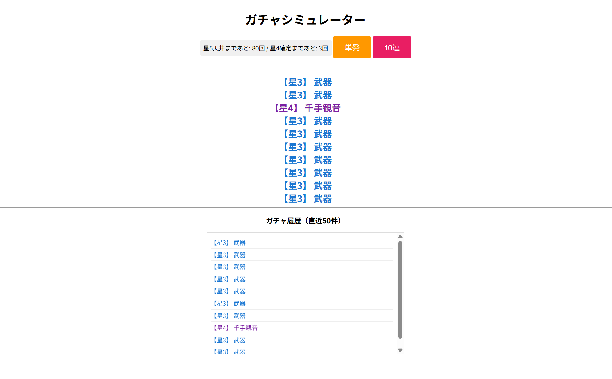

# 作品②

## 作品URL
[https://go-gacha-api.onrender.com]

学校外で趣味でGo言語中心に触れてみたガチャシミュレーターです  
Go言語などの学習にAIを活用しております  
ガチャシステムは実際のソーシャルゲームを元に作成しています  

## サイト画像

## 使用技術・アピールポイント
- **言語**: Go
- **技術的こだわり**: 
  あえてGinなどの外部ウェブフレームワークは使用せず、`net/http` や `encoding/json` といったGoの標準パッケージのみでAPIサーバーを構築し、言語の基礎的な動作原理の理解に努めました。
- **アルゴリズム**: `math/rand` を用いた実際のソーシャルゲームに近いガチャ確率判定の実装。
※HTML,CSS,JavaScriptについては直感的に操作するために使用しており、メインで学習をしたのはGo言語であり、それらは簡素な状態です。

## 使い方
上記のRenderのURL(https://go-gacha-api.onrender.com)  
にアクセスします。  
履歴や天井までの回数を確認できます。
ボタンをクリックするとガチャ結果が表示されます。  
※データベースやIDは現在未実装のため再度アクセスしたら履歴が消える、知らない履歴がある場合がございます。  
※無料のサーバーサービス「Render」を利用しているため、サーバーの起動に時間がかかる場合がございます。

## 更新
2026/05/31 SQLite導入
2026/06/05 石の消費システム追加
2026/06/25 ログイン処理追加

## 感想
C/C++でのゲームプログラミングを学んできた私がGo言語に触れて思ったこと  
思っていたよりも違和感なくプログラムを書くことができたと感じた。  
varやfuncなど何の定義かを先に書き後から型を書くようになっていたりなど慣れない書き方もあったが、
基本的な考え方は同じであったため経験を活用できる部分も多かった。  
そして、constやポインタはC/C++よりも便利に、安全に使えるようになっており快適さも感じた。  
逆にJavaScriptは相違点が多く慣れない部分が多かったと感じた。(それでもC/C++の経験は生きていたが)  
もっといろいろな言語に触れていきたいと思いました。
